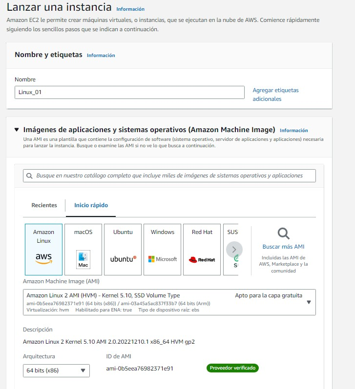
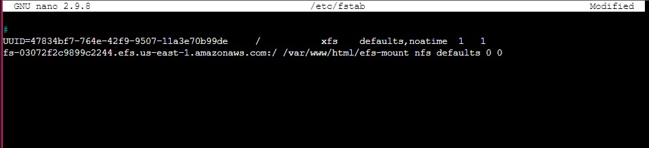

<h3> Víctor Fernández España </h3>
<h5> 1º DAW A BBDD 2022-2023 </h5>
  
<h1> Práctica 4.4 Deployment of an architecture EFS-EC2-MultiAZ in the CLoud (AWS)</h1>

 

<h2> Introducción a la práctica </h2>

 En esta practica se realizara un escenario que cuenta con 2 servidores WEB que alojaran un servicio similar a la pagina de Netflix, el cual nos mostrara una serie de peliculas y series para ver, junto a una informacion acerca de ello.

 Utilizaremos 2 EC2 de Amazon como servidores WEB del servicio. 

 Usaremos un sistema EFS para almacenar los archivos de nuestra pagina web, el codigo fuente, imagenes que se mostraran etc. 

 Todo ello bajo unos Grupos de Seguridad que: 

 En EC2 aceptaran peticiones de los usuarios que deseen acceder al sitio WEB y del sistema de almacenamiento EFS. 

 En EFS aceptaran peticiones de los servidores WEB. 

 Se creara también un Cluster Balanceador en EC2 para que este distribuya las peticiones entre los 2 servidores WEB.

Se ha decidido trabajar con el sistema de EFS ya que es un sistema muy util, pagamos por el almacenamiento que consumimos, fiable y de rapida accesibilidad. 

 Con todo ello conseguiremos una una arquitectura en la nube.

* High Availity 

* Multi AZ 

* Alto Rendimiento 

* Alta Seguridad 

* Con un cluster que distribuye las peticiones

   

<h2> 1. Creación del Grupo de seguridad</h2>

 
<h2> 1.1 Creación del Grupo de seguridad WEB</h2>
 

 Creamos un grupo de seguridad con las siguientes caracteristicas:

 

* Regla de entrada HTTP accesible para todo el mundo (0.0.0.0/0)
* Regla de entrada SSH accesible para todo el mundo (0.0.0.0/0)
  

 
<h2> 1.2 Creación del Grupo de seguridad EFS</h2>
 

 Creamos un grupo de seguridad con las siguientes caracteristicas:

* Regla de entrada NFS accesible con el origen personalizado (Seleccionamos el grupo de seguridad WEB )

 

 

   

<h2> 2. Creación de EC2 </h2>

 
<h2> 2.1 Creación 1ª EC2 </h2>

 Creamos una EC2 con las siguientes caracteristicas:

<li>   Todos los ajustes por defecto exceptuando los siguientes:    </li>
<li> SO Amazon linux    </li>
<li> Par de claves: vockey    </li>
<li> Configuracion de red -> Subred -> Zona disponibilidad -> acabado en -1a    </li>
<li> Seleccionar Grupo de seguridad existente -> Grupo de seguridad creado para el Servidor Web   </li>
<li> Detalles Avanzados --> Datos de Usuario: Introducimos estos comandos </li>

    #!/bin/bash
    yum update -y
    yum install httpd -y
    systemctl start httpd
    systemctl enable httpd
    yum -y install nfs-utils

  

 
 
 

<h2> 2.1 Creación 2ª EC2 </h2>

 Creamos otra EC2 con las mismas caracteristicas exceptuando: 

<li> Configuracion de red -> Subred -> Zona disponibilidad -> acabado en -1b    </li>
  

 

   
<h2> 3. Creación de NFS </h2>

 
<h2> 3.1 Creación NFS </h2>

 Creamos un NFS con las siguientes caracteristicas:

<li> VPC: Por defecto </li>
<li> Clase de almacenamiento: Estándar </li>
  

<h2> 3.2 Modicicación NFS </h2>

 Se diridira a Red -> Grupos de seguridad -> Seleccionaremos solamente el Grupo de seguridad anteriormente creado para NFS

  

   
<h2> 4. Configuracion de la EC2 </h2>

<h2> 4.1 Configuracion de la 1ª EC2 </h2>

 Se conectara a la EC2 y metemos los siguientes comandos:

    sudo su

    cd /var/www/html

    sudo mkdir efs-mount

    sudo mount -t nfs -o nfsvers=4.1,rsize=1048576,wsize=1048576,hard,timeo=600,retrans=2,noresvport *ID DE NUESTRO ENFS*.efs.us-east-1.amazonaws.com:/ efs-mount
    
    cd efs-mount

    sudo wget https://s3.eu-west-1.amazonaws.com/www.profesantos.cloud/Netflix.zip
    
    sudo unzip Netflix.zip 

    cd efs-mount

    sudo mount -t nfs -o nfsvers=4.1,rsize=1048576,wsize=1048576,hard,timeo=600,retrans=2,noresvport *ID DE NUESTRO ENFS*.efs.us-east-1.amazonaws.com:/ efs-mount

    systemctl restart apache2

Para que no se desmonte tendremos que en cada maquina debremos editar el archivo:

    sudo nano /etc/fstab

 Dentro de ese archivo pegaremos el DNS del EFS y acontinuacion este comando:
 
    /var/www/html/efs-mount nfs defaults 0 0

 Se editara el archivo de configuracion de Apache2 para que muestre nuestra pagina al introducir nuestra IP con el siguiente comando: 

    vim /etc/httpd/conf/httpd.conf

 Editamos Document Root para que cuando introduzcamos la IP se muestre nuestra pagina WEB. 

<h2> 4.2 Configuracion de la 2ª EC2 </h2>

 Hacemos lo mismo en la otra EC2

   
<h2> 5º Creación de Balanceador </h2>

<h2> 5.1 Creacion de la EC2 </h2>

 Lanzaremos una instancia EC2 con las siguientes caracteristicas:

<li>   Todos los ajustes por defecto exceptuando los siguientes:    </li>
<li> SO Ubuntu 22.04 LTS    </li>
<li> Par de claves: vockey    </li>
<li> Configuracion de red -> Permitir Trafico HTTP desde Internet    </li>

 Una vez este disponible introduciremos los siguientes comandos:

    sudo su                        
    apt get update                 
    apt install apache2            
    a2enmod proxy                  
    a2enmod proxy_http             
    a2enmod proxy_ajp              
    a2enmod rewrite                
    a2enmod deflate                
    a2enmod headers                
    a2enmod proxy_balancer         
    a2enmod proxy_connect          
    a2enmod proxy_html             
    a2enmod lbmethod_byrequests     
    systemctl restart apache2 

 Una vez reiniciado introduciremos los siguientes comandos:

    sudo nano /etc/apache2/sites-enabled/000-default.conf

 Se añadira este codigo cambiando en #Server1 y # Server2 por nuestra IP 

    <Proxy balancer://mycluster> 
    # Server 1 BalancerMember http://ip-http-server-1/ *IP PRIVADA*
    # Server 2 BalancerMember http://ip-http-server-2/ *IP PRIVADA* </Proxy> ProxyPass / balancer://mycluster/

    ProxyPassReverse "/images/" "balancer://myset/"

    <Location "/balancer-manager"> SetHandler balancer-manager Require host localhost </Location>

    <Location /balancer-manager> SetHandler balancer-manager Order Deny,Allow Allow from all </Location>

    ProxyPass /balancer-manager !

Una vez hecho esto se reiniciara el servicio apache (*systemctl restart apache2*) y accederemos al balanceador:

<li> http://34.196.139.200/balancer-manager </li>

Cambiamos la regla de entrada del grupo de seguridad WEB, cambiaremos el origen 0.0.0.0 por la IP PRIVADA del Balanceador.

